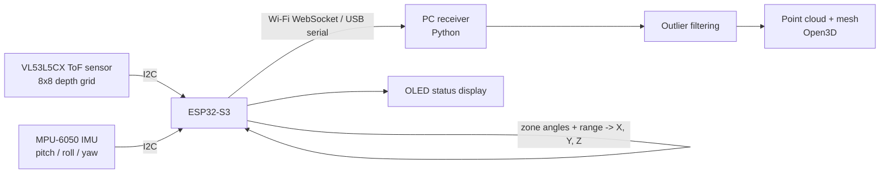

# Handheld 3D Surface Scanner using Multizone Time-of-Flight and IMU Fusion


A compact, **camera-free** handheld 3D scanner. An 8x8 multizone Time-of-Flight (ToF) sensor measures depth, an IMU tracks how the wand is moving, and an ESP32-S3 fuses both into a 3D point cloud that is streamed wirelessly to a PC and turned into a surface mesh.

> **Project status:** In development (B.Tech ECE, VIT-AP University). Items under [Roadmap](#roadmap) show what is done and what is still planned. Measured results are added to [Results](#results) as they are collected.

<!-- Add a photo or GIF of the working prototype here once available:

-->

---

## Why this project

| Camera-based scanning | This project |
|---|---|
| Fails in the dark, sensitive to glare | Active infrared sensing works in any lighting |
| Captures identifiable images, which raises privacy concerns | Captures only distance values, no images |
| Needs heavy image processing | Light embedded maths on the microcontroller |
| Fixed pan-tilt rigs need motors | Handheld, with no moving mechanical parts |

## How it works

A Time-of-Flight sensor emits short pulses of invisible 940 nm infrared light and measures how long they take to bounce back. Since light travels at a known speed, the delay gives distance: `d = c * t / 2`. The VL53L5CX does this for **64 zones (8x8) at once**. The IMU reports the wand's orientation, so every depth reading can be placed correctly in 3D space as the wand is swept over an object.



**Processing pipeline**
1. Read the 8x8 distance matrix from the ToF sensor.
2. Convert each zone's range and viewing angle into a 3D vector in the sensor frame (spherical to Cartesian).
3. Rotate the vectors into a fixed world frame using the IMU orientation.
4. Stream the points to the PC and accumulate them into a point cloud.
5. Filter outliers and reconstruct a surface mesh (Delaunay triangulation).

## Hardware

| Part | Role |
|---|---|
| ESP32-S3 dev board | Main controller, Wi-Fi streaming |
| VL53L5CX ToF breakout | 8x8 multizone depth sensing, 63 deg diagonal field of view, up to 15 Hz at 8x8 |
| MPU-6050 IMU | Orientation tracking |
| 0.96" I2C OLED | Live status display |
| 18650 Li-ion cell + TP4056 | Portable power and charging |
| 3D-printed or acrylic handle | Wand enclosure |

Full parts list and estimated costs: [`hardware/BOM.md`](hardware/BOM.md). Wiring: [`hardware/wiring.md`](hardware/wiring.md).

## Repository structure

```
tof-3d-surface-scanner/
├── README.md
├── LICENSE
├── .gitignore
├── requirements.txt
├── docs/                  Project report, design notes
├── hardware/              BOM, wiring, schematics, enclosure files
├── firmware/              ESP32-S3 code (PlatformIO)
│   ├── platformio.ini
│   └── src/
├── software/              PC-side Python code (maths, receiver, visualiser)
├── images/                Photos, diagrams, screenshots
└── demo/                  Videos and GIFs of the scanner working
```

## Getting started

### 1. Firmware
1. Install [VS Code](https://code.visualstudio.com/) and the [PlatformIO](https://platformio.org/) extension.
2. Open the `firmware/` folder.
3. Connect the ESP32-S3 and upload. The first sketch (`main.cpp`) is an **I2C scanner** to confirm both sensors are wired correctly (expected addresses: `0x29` for VL53L5CX, `0x68` for MPU-6050).

### 2. PC software
```bash
cd software
python -m venv venv
venv\Scripts\activate          # Windows
# source venv/bin/activate     # Linux / macOS
pip install -r ../requirements.txt
python transform.py            # runs the maths self-test
```

## Roadmap

- [x] Project design, component selection and architecture
- [x] Coordinate transform maths (`software/transform.py`)
- [ ] Interface VL53L5CX and MPU-6050 over I2C, verify 8x8 readout
- [ ] Portable power and OLED status screen
- [ ] On-device spherical to Cartesian conversion and IMU fusion
- [ ] Wi-Fi WebSocket streaming to PC
- [ ] Live point-cloud viewer (Open3D)
- [ ] Mesh reconstruction and noise filtering
- [ ] Enclosure, calibration and final demo

*Tick these off as you finish them. Honest progress is better than a finished-looking page.*

## Results

> To be filled in with real measurements.

| Metric | Value |
|---|---|
| Measurement range tested | [X mm to Y m] |
| Distance accuracy | [± X mm at Y m] |
| Update rate | [X Hz] |
| Scan time for a [object] | [X seconds] |
| Total hardware cost | [Rs. X] |

<!-- Add screenshots:  -->

## Known limitations

- **Yaw drift:** the MPU-6050 has no magnetometer, so yaw slowly drifts during long scans. A BNO085 (built-in sensor fusion) is a planned upgrade.
- **8x8 resolution is low** compared to LiDAR or depth cameras, so fine detail relies on sweeping and combining many frames.
- **Reflective or transparent surfaces** can produce wrong readings (multipath reflections).
- Accuracy depends on how well hand motion is tracked, so slow, steady sweeps work best.

## Applications

Contactless surface inspection, obstacle sensing for small indoor robots and drones, room and corner measurement, and privacy-sensitive profiling where cameras are not allowed.

## Future work

BNO085 orientation, multi-sensor arrays, Kalman-filter pose estimation, ICP-based scan alignment, ROS 2 integration, on-device defect detection (plane fitting).

## What I learned

*[Add 3 to 4 honest lines here, for example: I2C bus debugging, sensor calibration, coordinate frames, and handling noisy data. Recruiters read this section.]*

## Author

**[Your Name]** | B.Tech ECE (VLSI), VIT-AP University
[LinkedIn](https://linkedin.com/in/[handle]) | [Email](mailto:[yourname@email.com])

## License

Released under the [MIT License](LICENSE).
