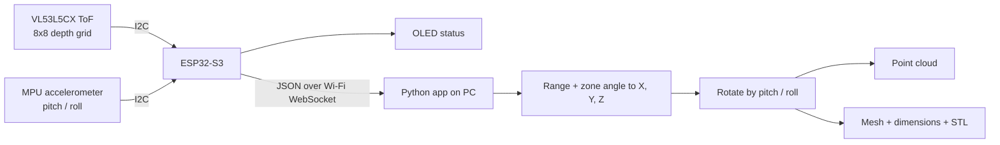
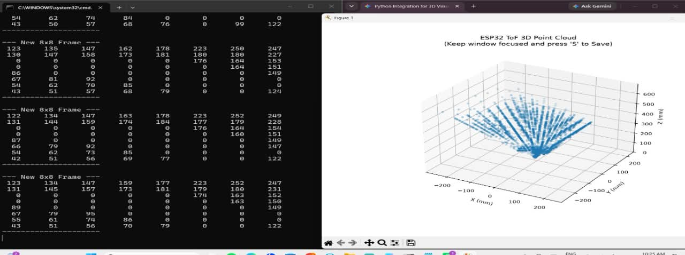
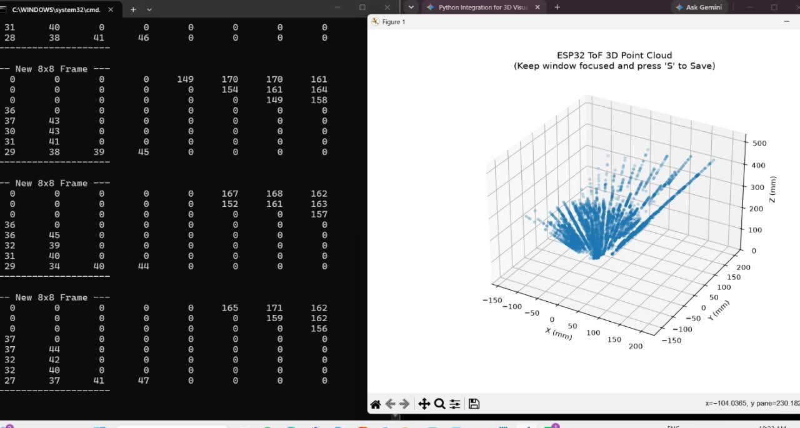
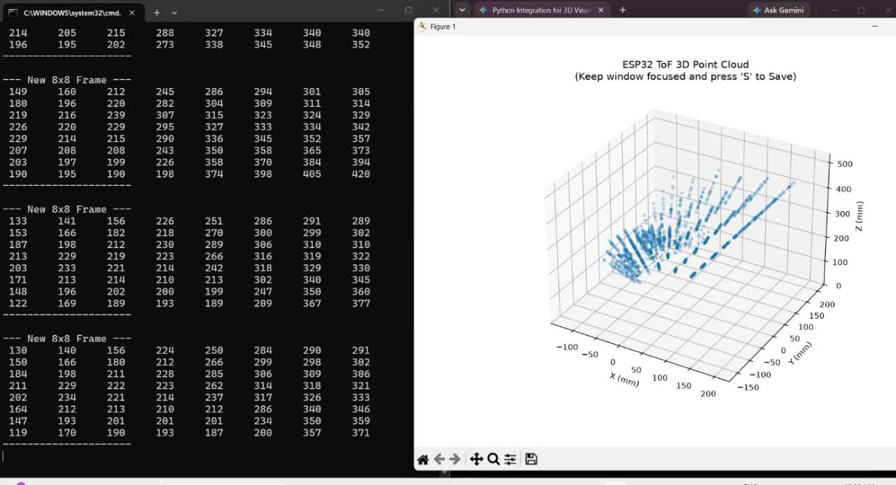

# Handheld Camera-Free 3D Surface Scanner (Multizone ToF + IMU Tilt Compensation)


A compact, **camera-free** handheld 3D scanner. An 8x8 Time-of-Flight (ToF) depth sensor and an inertial sensor are read by an ESP32-S3, which streams data over Wi-Fi to a Python application that shows a live depth map, a 3D point cloud and a surface mesh, measures the object's bounding box and exports STL files.

Built as a team project for **Engineering Clinics II, VIT-AP University**. The 3D-printed enclosure is still in progress.

<!-- Add a photo or GIF of the wand and the live viewer here:

-->

## What works today

- Live 8x8 (64-zone) depth capture at 15 Hz from the VL53L5CX
- Pitch and roll from the MPU accelerometer
- Wi-Fi access point and WebSocket streaming from the ESP32-S3 (`ws://192.168.4.1:81`)
- OLED status display (Wi-Fi, IP, sensor and client status, pitch, roll, frame count)
- PC app: 2D depth heatmap, live 3D point cloud, mesh generation, bounding-box dimensions, STL export

> **Scope:** the scanner is *orientation-aware* (pitch and roll). It does **not** estimate yaw or translation, so it is not a full 6-DOF tracker. See [Limitations](#known-limitations).

## How it works

A ToF sensor emits invisible 940 nm infrared pulses and times their return, so `distance = c x time / 2`. The VL53L5CX does this for 64 zones at once. The accelerometer gives the wand's tilt, which is used to rotate each reading into a common frame.



**Maths (in the PC app)**
```
angle_x = (col - 3.5) * (45 deg / 8)        angle_y = (row - 3.5) * (45 deg / 8)
local point = ( d*tan(angle_x), d*tan(angle_y), d )
world point = R(pitch, roll) * local point
```

**Mesh generation:** neighbouring valid zones are joined into triangles (triangles that bridge a depth jump larger than 30 mm are dropped), then smoothed with loop subdivision and Laplacian smoothing and coloured by depth.

## Progress so far (stage 1: USB serial point cloud)

The first stage printed raw 8x8 frames over serial and plotted accumulated points in matplotlib.

| Frame set 1 | Frame set 2 | Frame set 3 |
|---|---|---|
|  |  |  |

*Zeros in the grid are zones with no valid reading (target too close, too far or too reflective).* Stage 2, the Wi-Fi streaming app with mesh generation, is in `software/tof_surface_scanner.py`.

## Hardware

| Part | Role |
|---|---|
| ESP32-S3 dev board | Controller, Wi-Fi access point, WebSocket server |
| VL53L5CX | 8x8 multizone ToF, 63 deg diagonal field of view, up to 15 Hz at 8x8 |
| MPU-series IMU | Accelerometer for pitch and roll |
| 0.96" SSD1306 OLED | Status display |
| 18650 Li-ion + TP4056 | Portable power and charging |
| 3D-printed wand | Enclosure (in progress) |

Parts and costs: [`hardware/BOM.md`](hardware/BOM.md). Wiring: [`hardware/wiring.md`](hardware/wiring.md).

## Repository structure

```
├── firmware/
│   ├── tof_wifi_stream/       Main ESP32-S3 sketch (Arduino IDE)
│   └── i2c_scanner/           Wiring check
├── software/
│   ├── tof_surface_scanner.py Main Wi-Fi viewer and mesh builder
│   └── serial_pointcloud_viewer.py  Stage 1 serial viewer
├── hardware/                  BOM, wiring
├── docs/                      Project report
├── images/                    Screenshots and photos
├── demo/                      Videos / GIFs
└── requirements.txt
```

## Getting started

**1. Firmware.** Follow [`firmware/README.md`](firmware/README.md) (Arduino IDE, ESP32S3 Dev Module, four libraries), then upload `tof_wifi_stream`.

**2. PC app.**
```bash
pip install -r requirements.txt
```
Connect your PC to the Wi-Fi network `3D_Scanner_AP`, then run:
```bash
python software/tof_surface_scanner.py
```

**3. Scan.** Hold the wand 15-25 cm above an object and use the keys in the 3D window:

| Key | Action |
|---|---|
| `M` | Build surface mesh and print width / height / depth |
| `E` | Export the mesh as `.stl` |
| `C` | Clear the scene |
| `Q` | Quit |

## Roadmap

- [x] Hardware assembly and I2C bring-up (ToF, IMU, OLED)
- [x] Stage 1: serial 8x8 readout and point cloud
- [x] Stage 2: Wi-Fi WebSocket streaming
- [x] PC viewer: heatmap, point cloud, mesh, dimensions, STL export
- [ ] 3D-printed handheld enclosure
- [ ] Read the gyroscope and fuse it with the accelerometer (complementary or Madgwick filter)
- [ ] Yaw and translation estimation for multi-pose scans
- [ ] Accumulate several frames into one mesh
- [ ] Accuracy testing on known objects

## Results

> Fill in with real measurements.

| Test | Result |
|---|---|
| Object measured (known size) | [e.g. 100 mm box] |
| Measured width / height / depth | [X / Y / Z mm] |
| Error vs. ruler | [± X mm] |
| Usable range | [X mm to Y mm] |
| Update rate | 15 Hz (sensor setting) |

## Known limitations

- **Orientation only.** Pitch and roll come from the accelerometer alone; the gyroscope is not used. Yaw and the scanner's position are not estimated, so separate sweeps cannot be stitched together yet.
- **Tilt from the accelerometer is only reliable when the wand is nearly still**, because hand acceleration corrupts the gravity reading.
- **8x8 is the real resolution.** Subdivision and smoothing make the mesh look finer but add no new measurements.
- The mesh is built from the **current frame**, not a merged multi-frame scan.
- Shiny, transparent or very dark surfaces can give zero or wrong readings.

## Applications

Contactless surface and dimension checks, obstacle sensing for small robots, and privacy-sensitive profiling where cameras are not allowed.

## What we learned

I2C debugging, sensor noise and invalid zones, coordinate frames, constructing the project

## Team

Anagha Aiyandra

## License

[MIT](LICENSE)
